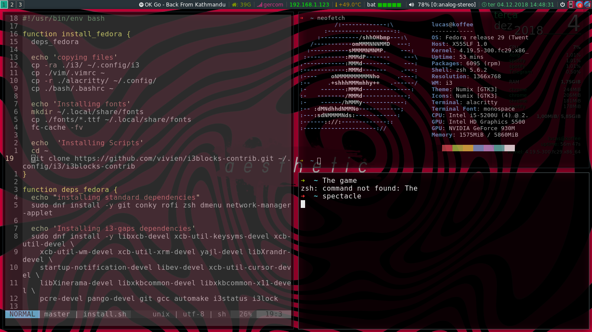

# dotfiles

## Dotfiles for:

* i3-gaps
* bash
* alacritty
* zsh

In fedora like systems, just executing the install script should be enough.

## For other distros, the following dependencies should be installed:

* i3-gaps
* i3blocks
* rofi
* zsh
* conky
* dmenu
* NetworkManager/network-manager-applet (name could vary depending on distro)
* alacritty
* vim 
* compton

## Screenshot(s)

